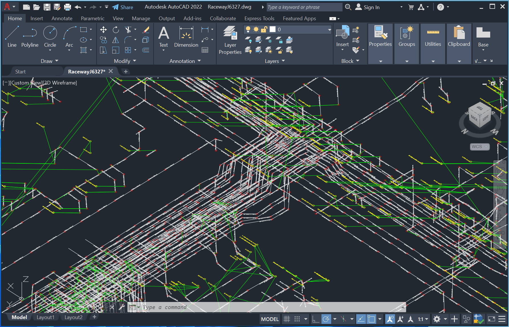

## Learn AutoCAD Automation with the .NET API

Each version of AutoCAD uses different .NET version:
- AutoCAD 2022 uses **.NET Framework 4.8** (Windows only)
- AutoCAD 2025 uses **.NET 8** (cross-platform)

A shared .NET project using the **.NET Standard 2.0** Target Framework can be referenced by either **.NET Framework 4.8** or **.NET 8** projects.

The main DLL files of the AutoCAD .NET API are:
- **AcCoreMgd.dll**. Use when working within the editor, publishing and plotting, and defining commands and functions that can be called from AutoLISP.
- **AcDbMgd.dll**. Use when working with objects stored in a drawing file.
- **AcMgd.dll**. Use when working with the application and user interface.
- **AcCui.dll**. Use when working with customization files.

The AutoCAD .NET API DLL files can be located at \<drive>:\Program Files\Autodesk\<release>

.NET library intended for use with **AutoCAD Core Console** should not reference any AutoCAD .NET DLL files that access AutoCAD UI such as:
- AcMgd.dll
- MFC and WPF dialog boxes and UI are not accessible

## Plotting Raceway Network with AutoCAD

The AutoCAD drawing template "*Raceway.dwg*" has pre-defined Block Definition for raceway and node on various layers. Each raceway and node is plotted as a Block Reference with Tag and ID attributes. The layer can be toggle to display and hide raceway, node, and text entities to reduce clutter.

s